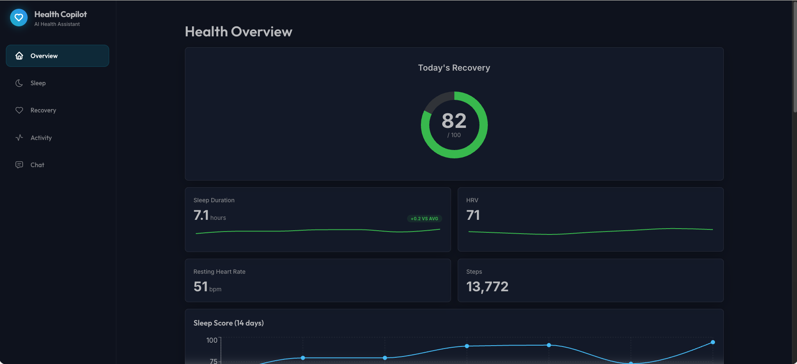
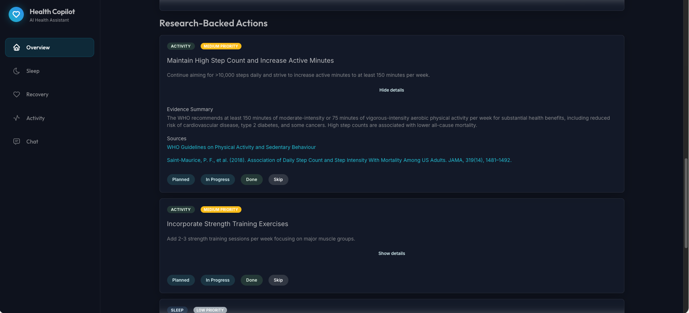
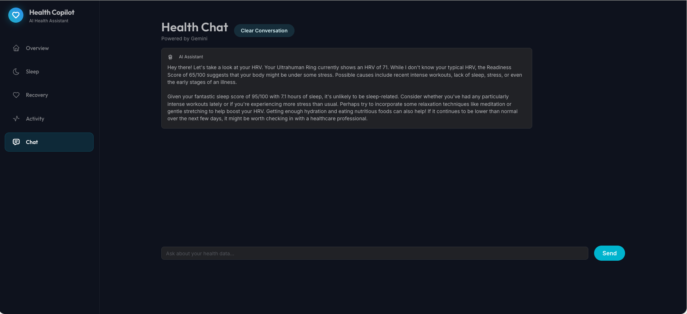

# Health Copilot

A local-first health dashboard that integrates your Ultrahuman Ring data with AI-powered insights and research-backed recommendations.

**Health Copilot** is designed to be your personal wellness command center. It goes beyond simple data visualization by using advanced AI to interpret your health metrics. Whether you're an athlete optimizing recovery or just trying to improve your sleep, Health Copilot helps you connect the dots between your daily habits and your physiological data.

Key capabilities include:
*   **Holistic Health View**: Aggregates Sleep, Recovery, and Activity data into a single, cohesive dashboard.
*   **AI-Powered Insights**: Uses Google Gemini to analyze your trends and answer questions like "Why is my HRV low today?" or "How can I improve my deep sleep?".
*   **Actionable Plans**: Generates personalized, research-backed action plans to help you reach your health goals.
*   **Privacy-Focused**: Built with a local-first architecture, ensuring your health data stays under your control.

---

## Features

- 📊 **Real-time Health Metrics** - Sleep, HRV, RHR, activity tracking
- 🎯 **Recovery Score** - Composite score based on multiple health factors
- 🤖 **AI Health Chat** - Chat with AI about your health data (Gemini)
- 📈 **Trend Analysis** - Visualize your health trends over time
- 💡 **Research-Backed Actions** - Get evidence-based recommendations
- 🌙 **Premium Dark UI** - Beautiful, modern interface with smooth animations

## Screenshots

<div align="center">
  
  <p><em>Dashboard Overview - Real-time metrics and trend analysis</em></p>
  <br/>
  
  
  <p><em>Research-Backed Actions - AI-generated health recommendations</em></p>
  <br/>
  
  
  <p><em>AI Health Chat - Context-aware conversations about your data</em></p>
</div>

## Architecture

```
health-copilot/
├── apps/
│   ├── dashboard/          # React + Vite frontend
│   └── orchestrator/       # Express backend API
└── package.json           # Root workspace config
```

### Technology Stack

- **Frontend**: React 18, TypeScript, Vite, Mantine UI v7, Recharts
- **Backend**: Node.js, Express, TypeScript
- **Integration**: Direct HTTP API for Ultrahuman
- **AI**: Google Gemini for health chat and insights

## Prerequisites

- Node.js >= 18.0.0
- npm >= 9.0.0
- Ultrahuman Ring with API access
- Google Gemini API key

## Getting Started

### 1. Obtain API Credentials

#### Ultrahuman API

1. Open the Ultrahuman app → Profile → Settings
2. Note your email address
3. Contact support@ultrahuman.com to request your API Token

#### Google Gemini API

1. Visit https://aistudio.google.com/app/apikey
2. Create an API key

### 2. Clone and Install

```bash
git clone https://github.com/yourusername/health-copilot.git
cd health-copilot
npm install
```

### 3. Configure Environment

```bash
cp .env.example .env
```

Edit `.env` and fill in your credentials:

```env
# Required
ULTRAHUMAN_AUTH_TOKEN=your_token_here
ULTRAHUMAN_USER_EMAIL=your_email@example.com
GEMINI_API_KEY=your_gemini_key_here

# Optional
PORT=4000
```

### 4. Start All Services

```bash
# Start everything at once
npm run dev:all
```

This will start:
- Backend API (http://localhost:4000)
- Frontend dashboard (http://localhost:5173)

### 5. Access the Dashboard

Open your browser to: **http://localhost:5173**

## API Endpoints

The backend exposes the following REST API:

- `GET /api/health/overview` - Today's metrics + trends
- `POST /api/health/actions` - Generate AI recommendations
- `GET /api/health/history?days=30` - Historical data
- `POST /api/chat/message` - Send chat message to AI
- `GET /api/chat/status` - Check chat availability

## Customization

### Change Recovery Score Formula

Edit `apps/orchestrator/src/utils/recovery.ts`:

```typescript
// Current formula:
// - Sleep Score: 40%
// - HRV: 30%
// - RHR: 20%
// - Activity: 10%

// Modify weights as needed
const sleepContribution = (today.sleep.score / 100) * 40;
```

### Change Theme Colors

Edit `apps/dashboard/src/theme.ts`:

```typescript
colors: {
  primary: [
    // Customize gradient colors
    '#e0f7ff',
    // ... more shades
  ],
}
```

## Project Structure

```
health-copilot/
├── apps/
│   ├── dashboard/
│   │   ├── src/
│   │   │   ├── components/      # Reusable UI components
│   │   │   ├── pages/           # Route pages
│   │   │   ├── services/        # API client
│   │   │   ├── hooks/           # Custom React hooks
│   │   │   ├── theme.ts         # Mantine theme config
│   │   │   ├── App.tsx          # Main app component
│   │   │   └── main.tsx         # Entry point
│   │   └── package.json
│   └── orchestrator/
│       ├── src/
│       │   ├── clients/         # API client wrappers
│       │   ├── routes/          # Express routes
│       │   ├── types/           # TypeScript types
│       │   ├── utils/           # Helper functions
│       │   └── index.ts         # Server entry point
│       └── package.json
├── .env.example
├── package.json
└── README.md
```

## Development

### Build for Production

```bash
npm run build
```

### Run Tests

```bash
npm run test
```

### Clean Build Artifacts

```bash
npm run clean
```

## License

MIT

## Support

For issues with:
- **Ultrahuman API**: Contact support@ultrahuman.com
- **This Application**: Open an issue on GitHub

---

Built with ❤️ using **Antigravity** by **[Sachin Acharya](https://www.linkedin.com/in/acharyasachin/)**
